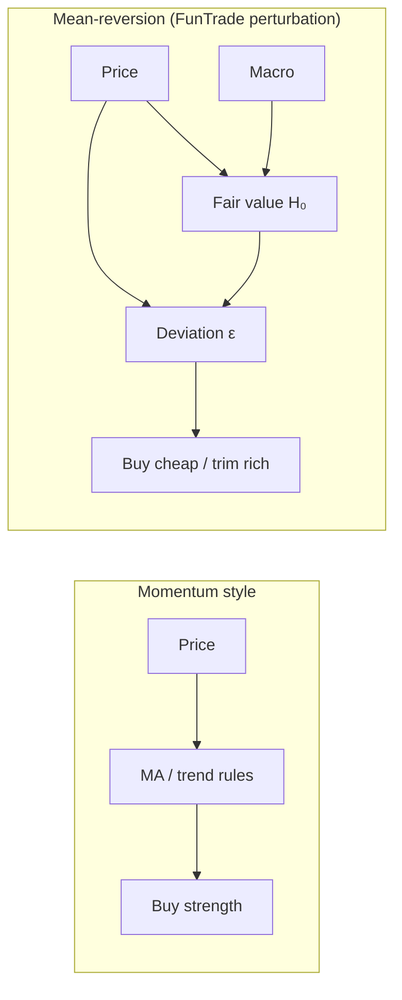
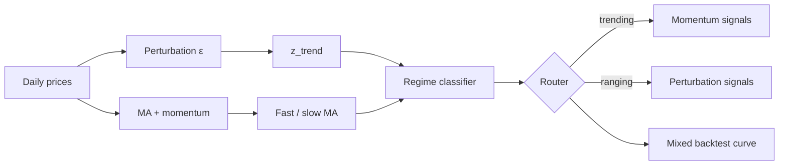

# FunTrade Trading Guide

A practical booklet for learning systematic trading on **European UCITS ETFs** and **mutual funds** — what the market is, how FunTrade thinks about it, and how to use the models without treating them as magic.

**Audience:** investors who already hold (or plan to hold) diversified funds via a broker like Nordnet, and want a **tactical overlay** on top of a long-term core — not day-traders or short sellers.

**Disclaimer:** FunTrade is a **research and paper-trading simulator**. Nothing here is investment advice. Backtest before you act. Past simulated performance does not guarantee future results.

---

## Table of contents

1. [What you are trading](#1-what-you-are-trading)
2. [Two families of systematic strategy](#2-two-families-of-systematic-strategy)
3. [FunTrade’s three models](#3-funtrades-three-models)
4. [The model stack: H₀, H₁, H₂](#4-the-model-stack-h₀-h₁-h₂)
5. [Macro factors: oil, climate, rates](#5-macro-factors-oil-climate-rates)
6. [Market regime and the auto router](#6-market-regime-and-the-auto-router)
7. [Reading signals: buy, hold, trim](#7-reading-signals-buy-hold-trim)
8. [Position sizing and the paper wallet](#8-position-sizing-and-the-paper-wallet)
9. [A sensible workflow for real portfolios](#9-a-sensible-workflow-for-real-portfolios)
10. [When each model tends to work](#10-when-each-model-tends-to-work)
11. [Configuration cheat sheet](#11-configuration-cheat-sheet)
12. [Common mistakes](#12-common-mistakes)
13. [Where to go next](#13-where-to-go-next)

---

## 1. What you are trading

### ETFs vs mutual funds

| | **ETF** (e.g. `VWCE.DE`) | **Mutual fund** (e.g. DNB Barnefond) |
|---|--------------------------|--------------------------------------|
| **Price** | Exchange-traded, intraday | Daily **NAV** (net asset value) |
| **Volume** | Real turnover on exchange | Often zero or stale in data feeds |
| **Liquidity gate** | FunTrade checks min daily EUR volume | Set `min_daily_volume_eur: 0` |
| **Benchmark for relative strength** | Symbol’s own price or sector ETF | Often use benchmark ETF (`trend_use_benchmark: true`) |
| **Calibration window** | ~504 trading days (~2 years) | ~730 days (~3 years) — slower-moving NAV |

Both are **pooled funds**: you own a slice of a basket, not individual stocks. FunTrade treats them as **daily time series** — one close (or NAV) per day.

### UCITS and European brokers

Most symbols in FunTrade are **UCITS ETFs** listed on Xetra (`.DE`) or similar. They are regulated, usually accumulating (no dividend drag in the price), and fit a buy-and-hold core.

Mutual funds are often referenced by **ISIN** or a Nordnet label. Map them to a Yahoo/Stooq ticker under `aliases` in `config.json`.

### What FunTrade is *not*

- Not a robo-advisor or asset allocator  
- Not intraday or high-frequency  
- Not shorting — **long-only** (you buy, hold, trim; you never sell short when flat)  
- Not a guarantee of beating buy-and-hold  

Think of it as a **copilot**: “this fund looks cheap or rich vs our fair-value model today.” You still decide and place orders.

---

## 2. Two families of systematic strategy

Most retail “trading bots” use **momentum** (trend-following):

- Buy when price goes **up** / breaks out  
- Sell when trend **breaks**  
- Classic tools: moving-average cross, RSI, “strength”

FunTrade’s primary model uses **mean-reversion** (perturbation):

- Estimate a **fair value band** (slow)  
- Measure **deviation** from that band (fast)  
- Buy when price is **cheap** vs fair value  
- Trim when price is **rich** vs fair value (while you hold shares)



Neither style is “correct” forever. **Trending bull markets** favour momentum. **Choppy or range-bound** periods favour mean-reversion. That insight motivates FunTrade’s **mixed (auto)** model — see [§6](#6-market-regime-and-the-auto-router).

---

## 3. FunTrade’s three models

In the **Recommendations** tab and **Backtest** UI you can compare three approaches:

| Model | Idea | Buy when | Sell / trim when |
|-------|------|----------|------------------|
| **Perturbation** | Mean-reversion to H₀ fair band | ε < −threshold, regime OK | ε > +threshold while holding |
| **Momentum benchmark** | Trend-following MA + momentum | Fast MA > slow MA (+ momentum filter) | MA cross-under or exit rules |
| **Auto (regime router)** | Pick perturbation or momentum per symbol/day | Whichever model the regime selects | Same, routed dynamically |

**Backtest** shows all three equity curves plus a **regime timeline** (trending / ranging / uncertain) for the mixed strategy.

### Perturbation in one sentence

> Slow fair value (H₀) + fast stress score (ε) → fade large deviations.

### Momentum in one sentence

> Ride the trend when fast moving average is above slow, with optional momentum confirmation; scale in gradually (`position_mode: scale`).

### Auto in one sentence

> Classify the market as trending or ranging; use momentum in trends and perturbation in ranges.

---

## 4. The model stack: H₀, H₁, H₂

FunTrade names layers after a physics metaphor (equilibrium + perturbation). You do not need the math — only what each layer **does**.

### H₀ — slow fair value anchor

**Inputs:**

- Log-price **seasonality** (annual pattern, smoothed with Fourier harmonics)  
- **Ornstein–Uhlenbeck (OU)** mean reversion level μ and volatility σ, calibrated on history  
- **Macro adjustment** — fair value shifts with z-scored macro factors (252-day window)

**Core macro (always on):**

| Factor | Typical weight | Intuition |
|--------|----------------|-----------|
| EUR rates proxy | +0.15 | Lower rates → higher fair value |
| Credit spread | +0.10 | Tighter credit → supportive |
| EUR/USD | +0.10 | Weaker EUR → headwind for USD-heavy funds |
| Sector beta residual | −0.10 | Sector-specific tilt |

**Output:** a **fair value band** around exp(season + μ + macro_adj), typically ±2σ in log-price space.

**Calibration:** `make calibrate-all` fits H₀ per symbol. Window length: `h0_calibration_days` in `config.json` (504 for ETFs, 730 for mutual funds).

### H₁ — fast perturbation ε

ε blends z-scored **stress components**:

| Component | Weight (ETF default) | Meaning |
|-----------|----------------------|---------|
| `z_return` | 0.35 | Price vs H₀ band (main mean-reversion driver) |
| `w_rel_strength` | 0.25 | Symbol vs sector/benchmark return |
| `w_volume` | 0.10 | Unusual volume (0 for mutual funds) |
| `z_vol` | 0.15 (fixed in code) | Short vs long volatility ratio |

**Trade rule (perturbation, long-only):**

- **BUY (+1):** ε < −`epsilon_threshold` and `regime_valid`  
- **SELL (−1):** ε > +`epsilon_threshold` and you **hold shares**  
- **HOLD (0):** inside the band, regime blocks buys, or flat with positive ε  

Default threshold for ETFs: **0.75**. On daily UCITS data, |ε| is often below 0.6 — so **few trades is normal**, especially in steady bull markets.

### H₂ — optional trend expectation

Controlled globally by `TREND_ENABLE=true` in `.env`.

| Setting | Effect |
|---------|--------|
| `trend_epsilon_weight` | Subtract trend from ε → less “overbought” sell pressure in rallies |
| `trend_fair_value_weight` | Lift H₀ fair value in uptrends → less structurally positive ε |
| `trend_gate_sells` | Block trim signals while medium-term trend is strong |
| `trend_use_benchmark` | Use sector ETF for trend (recommended for mutual funds) |

**Typical Nordnet overlay:** enable trend, gate sells in uptrends, use Recommendations with **“Assume I hold every symbol”** so SELL means *trim*, not *go short*.

---

## 5. Macro factors: oil, climate, rates

Optional H₀ factors live in `.env`. Enable with `H0_ENABLE_OIL` / `H0_ENABLE_CLIMATE`, ingest with `make ingest-factors`, then recalibrate.

### How macro enters fair value

Each factor is **z-scored over 252 days**, then multiplied by a weight and added to the log fair value:

```
macro_adj = Σ (weight × z_factor)
```

Positive weight + high z → **raises** fair value.  
Negative weight + high z → **lowers** fair value.

### Oil (`H0_WEIGHT_OIL`)

- **Input:** Brent/WTI price level (`BZ=F` by default)  
- **Slow-moving:** a spike stays in the z-score for months  

**Lesson learned:** a **negative** oil weight encodes “high oil permanently lowers equity fair value.” For **broad diversified ETFs**, oil spikes are often **transitory price shocks** — prices dip and bounce. That makes **positive** oil weight work better for perturbation:

- High oil → fair value **rises** slightly  
- Temporary equity dip → looks **below fair** → buy bias, not spurious sells  

For **oil-sensitive single names** (airlines, chemicals), negative weight can still make economic sense. For VWCE-style global equity, start with **+0.06 to +0.10**.

### Climate (`H0_WEIGHT_CLIMATE`)

- **Spread mode (recommended):** daily return of clean-energy ETF minus fossil return  
  - e.g. `INRG.L` vs `BZ=F`  
- **Single mode:** one clean-energy ETF level (behaves more like oil — use spread if you can)

Default weight is **+0.06** (already positive).

| Climate z high | Meaning | Positive weight effect |
|----------------|---------|------------------------|
| Clean beating fossil | Rotation into transition themes | Raises fair value |
| Fossil beating clean | Energy/old-economy leadership | Lowers fair value |

Climate spread is **return-based**, so it mean-reverts faster than oil **level**. Keep magnitude modest (0.04–0.08). It partially **offsets** oil on energy shocks because both use fossil as one leg.

### Practical tuning

1. Change weights in `.env` or the Streamlit sidebar (session override).  
2. `make calibrate-all && make detect`  
3. Compare Backtest / Recommendations before committing.

**Rule of thumb for perturbation on broad funds:**

| Factor | Suggested sign | Typical magnitude |
|--------|----------------|-------------------|
| Oil (level) | **Positive** | 0.06 – 0.10 |
| Climate (spread) | **Positive** | 0.04 – 0.08 |
| Core macro | Defaults in `.env` | Leave unless you have a view |

---

## 6. Market regime and the auto router

The **regime router** (`strategy_router` in `config.json`) labels each symbol **trending**, **ranging**, or **uncertain**, then picks a model:

| Regime | Condition (simplified) | Selected model |
|--------|------------------------|----------------|
| **Ranging** | \|z_trend\| ≤ 0.3 **or** many MA crossovers in 90 days | Perturbation |
| **Trending** | Fast MA > slow MA, momentum OK, z_trend ≥ 0.5 | Momentum |
| **Uncertain** | Neither | `default_model` (perturbation) |

**Hysteresis:** once a label is active, a new label must hold for **`regime_min_days`** (default 10) consecutive days before switching. This avoids flip-flopping at boundaries.

**Point-in-time:** backtest and live detect only use data ≤ today — no lookahead.



**Why it helps:** perturbation excels when price oscillates around fair value; momentum excels in persistent trends. The mixed backtest curve often tracks the **better** of the two on many symbols — but verify on *your* watchlist.

Config defaults (`config.json.example`):

```json
"strategy_router": {
  "trend_z_min": 0.5,
  "range_z_max": 0.3,
  "ma_cross_lookback_days": 90,
  "ma_cross_max_for_range": 2,
  "regime_min_days": 10,
  "default_model": "perturbation"
}
```

---

## 7. Reading signals: buy, hold, trim

### Perturbation signals

| Signal | You see in UI | Action (long-only overlay) |
|--------|---------------|----------------------------|
| BUY | Green, ε very negative | Add a **tranche** to an existing core or deploy cash |
| HOLD | Grey, \|ε\| inside band | Do nothing |
| SELL | Orange, ε very positive | **Trim** — only meaningful if you hold shares |

**`regime_valid`:** when false (stress spike or illiquid), **new buys are blocked**. Sells while holding can still fire — exiting risk is allowed even in stress.

### Momentum signals

| Signal | Condition |
|--------|-----------|
| BUY | Fast MA > slow MA (+ momentum above threshold if required) |
| SELL | Fast MA crosses under slow (if `exit_on_ma_crossunder`) |
| HOLD | No change in regime |

**Position modes** (`momentum_benchmark.position_mode`):

| Mode | Behaviour |
|------|-----------|
| `scale` | Add/remove one slice per day while trend persists — gradual build |
| `slice` | One slice per signal edge |
| `full` | All-in / all-out (aggressive; usually too harsh for real portfolios) |

Default: **`scale`** — realistic for ETF accumulation.

### Auto signals

Recommendations show **Regime**, **Strategy**, and the **active** signal from the selected model. Compare Auto vs pure Perturbation vs Momentum to see when the router disagrees.

---

## 8. Position sizing and the paper wallet

FunTrade simulates a **EUR wallet** — no broker connection in v1.

| Setting | Default | Meaning |
|---------|---------|---------|
| `PAPER_INITIAL_CASH_EUR` | 100000 | Starting cash |
| `PAPER_TRADE_SLICE_PCT` | 0.10 | Each trade uses up to **10% of initial cash** as a EUR tranche |
| `PAPER_FEE_BPS` | 5 | Fee per fill |
| `PAPER_POSITION_LIMIT_SHARES` | 1000 | Cap per symbol |

**Sizing rules:**

- Tranches → **fractional shares** (slice ÷ price)  
- Slice based on **starting** wallet, not current NAV  
- Buys capped by **cash available**  
- Sells are **incremental** (one slice per signal), not all-at-once  
- When |ε| is extreme, perturbation can **scale down** slice size for smoother entry  

Backtest uses the same slice logic (`BACKTEST_TRADE_SLICE_PCT`).

This matches a **tactical overlay** mental model: you have a €100k core; the model suggests moving €10k at a time, not flipping the entire portfolio daily.

---

## 9. A sensible workflow for real portfolios

FunTrade works best as a **layer on strategic buy-and-hold**, not a replacement for asset allocation.

### Recommended structure

```
Strategic core (you)          Tactical overlay (FunTrade)
─────────────────────         ───────────────────────────
Target weights / DCA    +     Trim when rich, add when cheap
VWCE, bonds, etc.             Per-symbol ε or auto regime
Rebalance yearly              Daily signals, act weekly/monthly
```

### Daily / weekly routine

1. **After market close** (evening EU): `make refresh` or UI **Run refresh**  
2. Open **Recommendations** → model **Auto (regime router)** or Perturbation  
3. Enable **“Assume I hold every symbol”** if you maintain a full Nordnet watchlist  
4. Review BUY / SELL / HOLD — cross-check **Backtest** for the symbol if unsure  
5. Place **manual orders** in Nordnet (FunTrade does not execute live)  

### First-time setup (live data)

```bash
make setup && make run
make ingest && make ingest-factors
make calibrate-all
make detect
make ui    # http://localhost:8501
```

### When to recalibrate

| Change | Action |
|--------|--------|
| Edited `epsilon_threshold`, weights in `config.json` | `make detect` |
| Edited H₀ macro weights or enabled oil/climate | `make ingest-factors`, `make calibrate-all`, `make detect` |
| Added symbols to watchlist | `make ingest SYMBOLS='…'`, `make calibrate-all` |

Weekly calibrate is enough for most users; daily detect after ingest is the important habit.

---

## 10. When each model tends to work

| Market character | Perturbation | Momentum | Auto (mixed) |
|------------------|-------------|----------|--------------|
| Range-bound, choppy | Strong | Whipsaws | Routes to perturbation |
| Steady bull trend | Few buys, trim gating helps | Strong | Routes to momentum |
| Crash then bounce | Buys dips if regime valid | Late entry | Depends on regime flip lag |
| Mutual fund NAV, slow | Good with long H₀ window | Less data for MA | Often perturbation |
| Single volatile share | Tune regime gates carefully | Higher turnover | Test both |

**Empirical pattern (from research on this codebase):**

- **Perturbation** beats momentum when price **mean-reverts** around a stable fair band (e.g. DNB funds in chop, European equity in sideways years).  
- **Momentum** beats perturbation in **persistent trends** (e.g. multi-year global equity rally).  
- **Mixed (auto)** often picks the better candidate **most of the time** — but always backtest your symbols; hysteresis adds lag at regime changes.

---

## 11. Configuration cheat sheet

### Three places parameters live

| Where | Examples | Persists? |
|-------|----------|-----------|
| `config.json` | Watchlist, ε threshold, regime gates, strategy_router | Yes |
| `.env` | H₀ macro, trend on/off, wallet size | Yes |
| Streamlit sidebar | Threshold, H₁ weights, oil/climate sliders | Session only |

### Starter profiles

**A — Nordnet trim overlay (default-ish ETF)**

- `epsilon_threshold: 0.75`, `trend_gate_sells: true`, `TREND_ENABLE=true`  
- Recommendations: assume holding all symbols  
- Model: **Auto** or **Perturbation**

**B — More active tactical**

- Lower threshold (0.55), `trend_gate_sells: false`  
- Validate trade count in Backtest first

**C — Mutual funds (NAV)**

- `min_daily_volume_eur: 0`, `w_volume: 0`, `h0_calibration_days: 730`  
- `trend_use_benchmark: true`, `trend_fair_value_weight: 0.15`

**D — Macro-aware perturbation**

- `.env`: `H0_ENABLE_OIL=true`, `H0_WEIGHT_OIL=0.10` (positive)  
- `.env`: `H0_ENABLE_CLIMATE=true`, `H0_CLIMATE_MODE=spread`, `H0_WEIGHT_CLIMATE=0.06`  
- `make ingest-factors && make calibrate-all`

Full parameter reference: [tuning-guide.md](tuning-guide.md).

---

## 12. Common mistakes

| Mistake | Why it hurts | Fix |
|---------|--------------|-----|
| Expecting many buys in a bull market | Mean-reversion: price sits above fair → positive ε | Lower threshold, raise `trend_fair_value_weight`, or use Auto |
| Negative oil weight on global ETFs | High oil lowers fair value → spurious sells on dips | Use **positive** oil weight |
| Ignoring `regime_valid` | Buys blocked during stress — looks “broken” | Check regime spike settings; may be correct behaviour |
| Mutual fund with volume gate | NAV funds fail liquidity check | `min_daily_volume_eur: 0` |
| Treating SELL as “go short” | Long-only: SELL = exit/trim while holding | Enable “assume I hold every symbol” |
| Changing sidebar only, expecting Grafana to match | Sidebar overrides session; DB uses `config.json` | Edit `config.json` + `make detect` for persisted history |
| Skipping backtest | More signals ≠ better returns | Compare vs buy-and-hold in UI |
| `position_mode: full` on momentum | Unrealistic all-in/all-out | Use `scale` (default) |

---

## 13. Where to go next

| Document | Content |
|----------|---------|
| [README.md](../README.md) | Install, Makefile commands, architecture |
| [tuning-guide.md](tuning-guide.md) | Strategy presets, every parameter explained |
| [component-model.md](component-model.md) | Formal H₀ / H₁ / H₂ definitions |
| [data-providers.md](data-providers.md) | Stooq, yfinance, aliases |
| [future-paths.md](future-paths.md) | Live broker integration (not in v1) |

### Quick verification checklist

```bash
make migrate          # if upgrading DB
make ingest-factors   # if using oil/climate
make calibrate-all
make detect
cd python && uv run pytest -q
make ui
```

In the UI:

- **Recommendations → Auto** — check Regime / Strategy columns  
- **Backtest** — compare Perturbation, Momentum, and **Mixed (auto)** curves  
- **Trade tab** — ε chart vs fair band for intuition  

---

*Last updated for FunTrade v1: perturbation + momentum + regime router (mixed auto), positive oil weight guidance, climate spread mode.*
