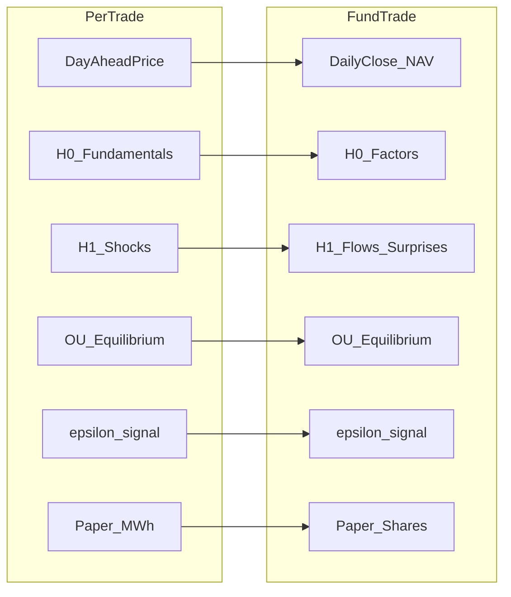
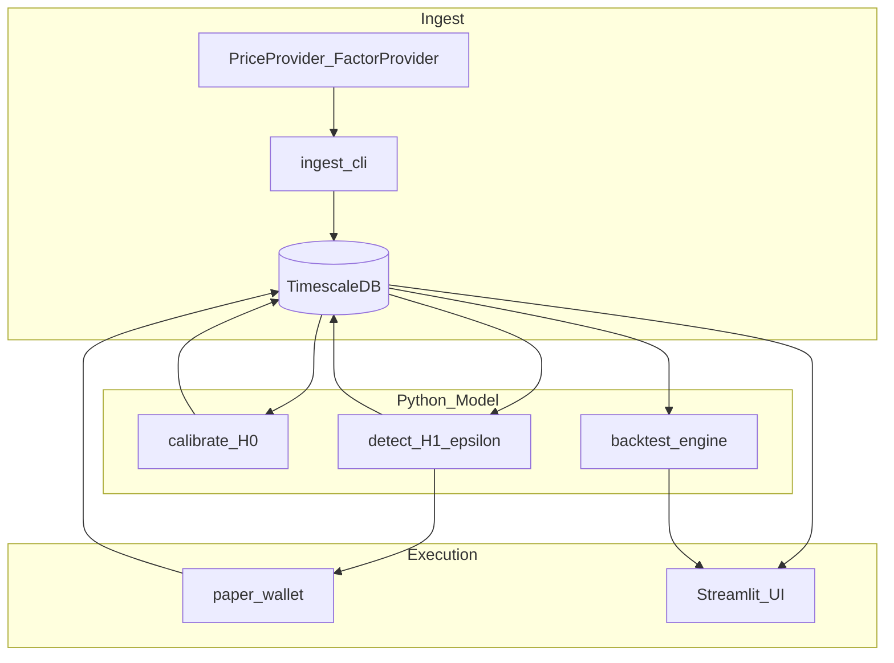

# Fund/ETF Perturbation Trader — Session Handoff Plan

## Context from PerTrade (what you learned, what to leave behind)

**Carry forward:**
- **H₀ / H₁ split** — structural fair value vs deviation drivers ([`docs/component-model.md`](docs/component-model.md))
- **OU mean reversion** on deseasonalized log-price ([`python/pertrade/models/equilibrium.py`](python/pertrade/models/equilibrium.py))
- **ε blending** + regime gates ([`python/pertrade/models/perturbation.py`](python/pertrade/models/perturbation.py))
- **Walk-forward backtest**, threshold sweep, buy-and-hold baseline ([`python/pertrade/backtest/engine.py`](python/pertrade/backtest/engine.py))
- **Paper wallet** with realized/unrealized PnL ([`python/pertrade/execution/paper.py`](python/pertrade/execution/paper.py))
- **Streamlit console** pattern ([`python/pertrade/ui/`](python/pertrade/ui/))
- **TimescaleDB + Grafana** for observability
- **Formula-1 simulator** ethos: prove the model on public data before any membership/KYC

**Leave behind (power-specific traps):**
- Delivery hours, DA vs intraday clearing, BRP/TSO settlement
- Zone-scoped physical units (MWh) — replace with **shares / notional / weight**
- Nord Pool / ENTSO-E as hard dependencies
- C# ingestion worker unless you need 24/7 polling at scale (start **Python-only**)

---

## Recommended new repo layout

Greenfield repo (do not bolt onto `per-trade`): e.g. **`spektr-fundtrade`** or **`fundperturb`**.

```
fundtrade/
  python/fundtrade/          # models, backtest, paper, ui, data adapters
  sql/                       # hypertables: bars, signals, paper_trades, portfolio
  grafana/                   # Market, Model, Paper dashboards
  docs/
    component-model.md       # H0/H1 for funds (ported concept)
    data-providers.md        # pluggable provider matrix
    future-paths.md          # live broker, tax, compliance (out of scope v1)
  docker-compose.yml         # TimescaleDB + Grafana (copy pattern from per-trade)
  Makefile
  .env.example
```

**Stack (v1):** Python 3.12+, `uv`, TimescaleDB, Streamlit, Grafana. Optional later: .NET monitor if you want C# parity with PerTrade.

---

## Conceptual mapping: power → funds/ETFs



| PerTrade | Fund/ETF analog | Notes |
|----------|-----------------|-------|
| Zone (`NO1`) | **Symbol** (`SPY`, `EUNL.DE`) | Universe is a watchlist, not geography |
| Hourly bar | **Daily bar** (v1); optional intraday later | Avoid hourly OU until you need it |
| Day-ahead price | **Adj close** or **NAV** | Use adjusted prices for backtest honesty |
| H₀ fundamentals | **Slow factors**: rates, credit spread, USD, sector beta | Z-score vs 252d window |
| H₁ perturbations | **Fast surprises**: rel strength, vol spike, flow proxy, earnings season | No ENTSO-E equivalent required |
| `regime_valid` | **Risk-off halt**: VIX, max drawdown, liquidity filter | Critical for ETFs |
| `qty_mwh` | **Shares** or **notional EUR/USD** | Config: `TRADE_NOTIONAL` or `TRADE_SHARES` |
| Intraday exit | **Optional**: premium/discount to iNAV | Defer; daily rebalance is enough for v1 |

---

## H₀ / H₁ design for funds (define before coding)

Document in [`docs/component-model.md`](docs/component-model.md) (new repo).

**H₀ — expected equilibrium (slow):**
- OU on **deseasonalized log(price)** with **calendar seasonality** (month/day-of-week; drop hour-of-week unless using intraday data)
- Optional fundamental adjustment: `log P_expected = s(t) + μ + Σ βᵢ zᵢ`
- Candidate H₀ drivers (provider-agnostic IDs):
  - `risk_free_proxy` — 10Y yield or short rate ETF
  - `credit_spread` — HYG-LQD spread or similar
  - `usd_strength` — DXY or FX pair
  - `sector_beta` — regression vs benchmark (SPY / STOXX) residual

**H₁ — perturbations (fast):**
- `z_return` — return vs equilibrium band
- `z_volume` — volume vs 20d median (liquidity stress)
- `z_rel_strength` — symbol return minus sector ETF return
- `z_vol` — realized vol vs trailing baseline
- `z_premium` — (ETF price − NAV proxy) / NAV — only if NAV data available

**Signal (same shape as PerTrade):**
```
ε = w_price·z_return + w_vol·z_volume + … + w_h1·z_h1_components
```
Trade when `|ε| > threshold` and `regime_valid`.

**Calibration:** port [`calibrate_equilibrium`](python/pertrade/models/equilibrium.py) — change seasonality from hour to **month + day-of-week**; half-life in **days** not hours.

---

## Data layer (provider-agnostic)

Define a small protocol in `python/fundtrade/data/provider.py`:

```python
class PriceProvider(Protocol):
    def fetch_bars(self, symbol: str, start, end, interval: Literal["1d"]) -> pd.DataFrame: ...

class FactorProvider(Protocol):
    def fetch_series(self, series_id: str, start, end) -> pd.Series: ...
```

**Implementations (pick one in session 1; keep interface stable):**

| Provider | Pros | Cons |
|----------|------|------|
| **yfinance** | Free, broad US + many EU tickers | Unofficial, can break; no SLA |
| **Stooq** | Free daily, CSV-style | Coverage varies |
| **EOD Historical Data** | Cleaner API, global | Free tier limits |
| **Alpha Vantage** | Free tier | Rate limits |
| **Local CSV** | Reproducible research | Manual updates |

**Ingest pattern (mirror PerTrade):**
- `price_bars(symbol, market='close', source='yfinance')` — daily OHLCV + adj close
- `factor_signals(symbol/series_id, role='h0'|'h1')` — same table shape as [`fundamental_signals`](sql/003_fundamental_signals.sql) in per-trade
- `make run-ingest` — backfill watchlist + factor series on schedule

**Reconciliation (mirror [`reconcile.py`](python/pertrade/data/reconcile.py)):** compare two providers for same symbol/date; flag >N bp divergence.

**Explicit v1 constraint:** single price series per symbol per day (no “entry DA / exit intraday” ambiguity that blocked PerTrade).

---

## Database schema (minimal v1)

Adapt from [`sql/001_init_schema.sql`](sql/001_init_schema.sql) + paper tables:

- `price_bars(time, symbol, market, price, volume, source)` — `market='adj_close'`
- `factor_signals(time, symbol_or_series, component_id, value, role, source)`
- `equilibrium_params(symbol, kappa, mu, sigma, half_life_days, calibrated_at, coeffs_json)`
- `perturbation_events(time, symbol, epsilon, magnitude, regime_valid, inputs_json)`
- `paper_trades`, `paper_positions`, `paper_cash` — **shares + currency**, not MWh

---

## Modules to port (copy + rename, ~60% reuse)

| Source (per-trade) | Target | Changes |
|--------------------|--------|---------|
| [`equilibrium.py`](python/pertrade/models/equilibrium.py) | `models/equilibrium.py` | Daily seasonality; `symbol` not `zone` |
| [`perturbation.py`](python/pertrade/models/perturbation.py) | `models/perturbation.py` | Factor columns; benchmark-relative z-scores |
| [`components.py`](python/pertrade/models/components.py) | `models/components.py` | New H0/H1 component table for funds |
| [`backtest/engine.py`](python/pertrade/backtest/engine.py) | `backtest/engine.py` | Daily bars; transaction cost in bps; no intraday merge |
| [`execution/paper.py`](python/pertrade/execution/paper.py) | `execution/paper.py` | Shares, currency, fee in bps |
| [`ui/app.py`](python/pertrade/ui/app.py) | `ui/app.py` | Symbol picker, benchmark compare |
| [`config.py`](python/pertrade/config.py) | `config.py` | `WATCHLIST`, `BENCHMARK`, `CURRENCY` |
| [`cli.py`](python/pertrade/cli.py) | `cli.py` | `calibrate`, `detect`, `backtest`, `paper`, `ingest`, `reconcile` |

**Do not port:** `entsoe_*`, `nordpool_*`, `epex_ida`, C# clients, zone neighbor flows.

---

## Execution & PnL semantics (simpler than power)

- **Position:** net shares per symbol (or single-symbol focus in v1)
- **Mark:** latest adj close
- **Realized PnL:** on sell, FIFO or avg-cost (match PerTrade paper logic)
- **Costs:** `fee_bps` + optional `slippage_bps` in backtest
- **Constraints:** max position weight, max single-name %, cash buffer
- **No settlement calendar complexity** in v1 (T+1 optional later)

---

## Phased delivery (for the new session)

### Phase 0 — Scaffold (day 1)
- New repo, `docker compose`, `.env.example`, `uv` project, empty `fundtrade` package
- `docs/component-model.md` + `docs/data-providers.md`
- Watchlist config: `WATCHLIST=SPY,QQQ,TLT,GLD` (example; user replaces)

### Phase 1 — Data + H₀ (days 2–3)
- `PriceProvider` implementation (first adapter)
- Ingest CLI → `price_bars`
- Port OU calibration; store `equilibrium_params`
- Grafana: price + equilibrium band panel

### Phase 2 — H₁ + ε + backtest (days 4–5)
- Factor ingest (rates, vol index, sector ETF)
- `detect` + `perturbation_events`
- Backtest engine with threshold sweep; compare vs buy-and-hold benchmark
- Unit tests with fixed CSV fixtures (no network in CI)

### Phase 3 — Paper + UI (days 6–7)
- Paper wallet (shares, currency PnL labels: realized / unrealized / total)
- Streamlit: Wallet, Backtest, Trade tabs (mirror PerTrade UX)
- `make run-ui`, `make run-paper`

### Phase 4 — Hardening (optional)
- Second data provider + reconcile
- Regime invalidation tuning (VIX, drawdown)
- Jacobian / weight sensitivity ([`sensitivity/jacobian.py`](python/pertrade/sensitivity/jacobian.py))

### Phase 5 — Future (document only, [`docs/future-paths.md`](docs/future-paths.md))
- Live broker adapter (IBKR, Nordnet API, etc.) — requires KYC, not R&D blocker
- Tax lot tracking, dividend adjustments
- UCITS vs US tax/reg reporting

---

## Architecture diagram (v1)



---

## Session 1 checklist (paste into new chat)

1. Create repo `spektr-fundtrade` (or name of choice); copy docker/Makefile patterns from [`per-trade`](.)
2. Choose **first data provider** (yfinance is fastest for MVP); document in `data-providers.md`.
3. Define **watchlist** + **benchmark symbol** in `.env`.
4. Implement daily ingest + `price_bars` schema.
5. Port equilibrium calibration; verify half-life and band on one ETF (e.g. 2y history).
6. Add 3–5 H₁ factors; run `detect` and inspect ε distribution.
7. Run backtest vs buy-and-hold; only then build paper wallet + UI.
8. Write `docs/lessons-from-pertrade.md` — one page: DA/intraday trap, membership barriers, MTM vs realized labels.

---

## Success criteria (R&D complete, no broker)

Same bar as PerTrade [`docs/future-paths.md`](docs/future-paths.md):

1. Reproducible backtests on 2+ years of public daily data
2. Cross-provider reconciliation on watchlist (if two sources used)
3. Forward paper track record with documented ε thresholds and regime stops
4. Grafana + Streamlit showing equilibrium, ε, and simulated PnL

---

## Open decisions (resolve in session 1, not blocking this plan)

- **Currency:** single base (EUR, USD, NOK) vs per-symbol native
- **Universe size:** single ETF first vs basket rotation
- **Rebalance frequency:** daily close only vs weekly
- **Long-only vs long/short** (short ETFs exist but add complexity)

Default recommendation for fastest learning loop: **one benchmark + 5–10 liquid ETFs, daily bars, long-only, USD or EUR base, paper-only.**
